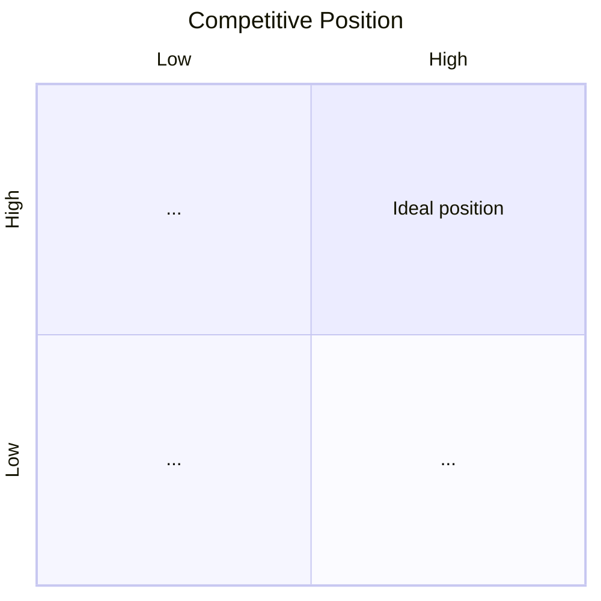

# Step 11: Chart Your Competitive Position

## Role in the 24 steps

Third step of Theme 3. Turns the Core and resulting competitive advantages (Step 10) into a
visual, persona-grounded competitive position: a 2x2 chart on the two criteria that actually
drive Persona's choice, with all real alternatives — including the status quo — plotted honestly.

## Read before starting

- `.startup/<slug>/business-state.json`, including `business_basics.business_type` — read before
  choosing axes (see "Business-type branching").
- `.startup/<slug>/plan/10-define-your-core.md` — **required**, the competitive advantages to
  plot from.
- `.startup/<slug>/plan/05-profile-the-persona-for-the-beachhead-market.md` — whose priorities
  define the axes.
- `.startup/<slug>/plan/08-quantify-the-value-proposition.md` — the quantified benefit dimensions
  and next-best-alternative comparison. If Step 10 is missing or `not_started`, stop and tell the
  founder to complete it first.

## Interview the founder

1. From Persona's perspective, what are the **top two criteria** they use when comparing
   solutions (e.g., price vs. performance, ease-of-use vs. depth of features, speed vs.
   accuracy)? These must come from what you actually learned about Persona's priorities (Steps 5
   and 8) — not generic axes chosen for convenience.
2. Who or what are the alternatives Persona actually considers — direct competitors, adjacent
   products, and the status quo/do-nothing (always include status quo; per Step 8 it's often the
   toughest competitor)?
3. Where does each alternative fall on those two axes, roughly, based on what you know — customer
   feedback, competitor marketing, your own testing?
4. Where does your product fall — does it occupy a genuinely open, differentiated position, or is
   it uncomfortably close to an incumbent?
5. Is that position defensible given your Core (Step 10), or could a competitor move to match you
   on both axes without much difficulty?

## Business-type branching

- **SaaS:** axes commonly cluster around depth of integration vs. ease of use, or price vs.
  feature depth — but confirm against what Persona actually said mattered (Steps 5/8), don't
  default to these.
- **Physical product:** axes commonly cluster around price vs. quality/durability, or convenience
  vs. customization.
- **Services:** axes commonly cluster around price vs. expertise/customization, or speed vs.
  quality of outcome.
- **Marketplace:** the two sides frequently face different alternatives — a supplier's alternative
  may be a different marketplace or selling direct, while a buyer's alternative may be a different
  marketplace or the status quo. If the sides' competitive landscapes genuinely diverge, chart them
  as two separate positioning maps rather than forcing one chart to represent both sides honestly.

## Method: axes chosen by the persona's priorities, not by convenience

1. **Choose the two axes from Persona's actual priorities** (Steps 5/8) — if the founder proposes
   generic axes ("price vs. quality") not traceable to specific research, push back and ask what
   Persona actually said mattered most.
2. **Always plot the status quo/"do nothing"** as one of the points on the chart.
3. **Plot every real alternative** the founder can substantiate — verify competitor claims via
   WebSearch where public information exists, and cite it.
4. **Plot your own product** at the position your Core (Step 10) genuinely earns — not an
   aspirational "up and to the right of everyone" placement.
5. **State explicitly whether the position is defensible** — tie this back to whether the Core
   passed the Unique/Important/Grows test in Step 10.

A simple Mermaid quadrant chart is a good way to render this when the output format supports it:



## When the founder doesn't know competitor positions

Don't state a specific claim about a competitor's performance or pricing as fact without a
source. Use WebSearch for publicly available competitor information and cite it. Where a position
can't be verified, mark it "estimated — unverified" in the chart and add a `key_assumptions`
entry: `step_ref`: `11_chart_your_competitive_position`, `confidence`: `low`, `test_plan`:
"validate via a competitor trial or customer interviews about why they chose or left competitor
X," `test_result`: `null`. Any specific competitor metric stated as fact (e.g., a competitor's
price) needs a `quantitative_claims` entry with a source, same as any other fact-claim.

## Write `plan/11-chart-your-competitive-position.md`

```markdown
# Step 11: Competitive Position Chart

## Chosen axes
(X, Y — and why, tied explicitly to Persona's priorities from Steps 5/8)

## Alternatives considered
(including status quo/do-nothing)

## Position chart
| Player | X-axis value | Y-axis value | Notes |
|---|---|---|---|

(optional: Mermaid quadrantChart rendering of the same data)

## Your differentiated position
(and why it's defensible — ties back to Step 10's Core)

## Assumptions flagged
```

## Update `business-state.json`

```json
"disciplined_entrepreneurship": {
  "11_chart_your_competitive_position": {
    "status": "drafted",
    "summary": "Axes: <X> vs <Y>; position: <one line>; defensibility: <defensible|contestable>",
    "file": "plan/11-chart-your-competitive-position.md"
  }
}
```

Append any new `key_assumptions` and `quantitative_claims` entries; preserve every other key
untouched.

## Definition of done

- Axes traceable to specific persona research, not chosen for convenience.
- Status quo plotted alongside real competitors.
- Any competitor fact-claim sourced via `quantitative_claims`; unverified positions flagged.
- Explicit defensibility judgment tied to Step 10's Core.
- `business-state.json` key `11_chart_your_competitive_position` set to `status: "drafted"`.
- Stop here — review/approval happens later via the council skill, not this one.
